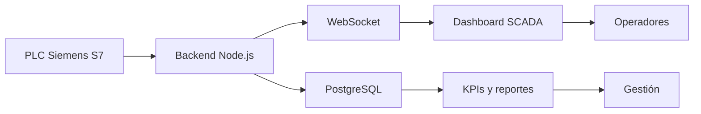
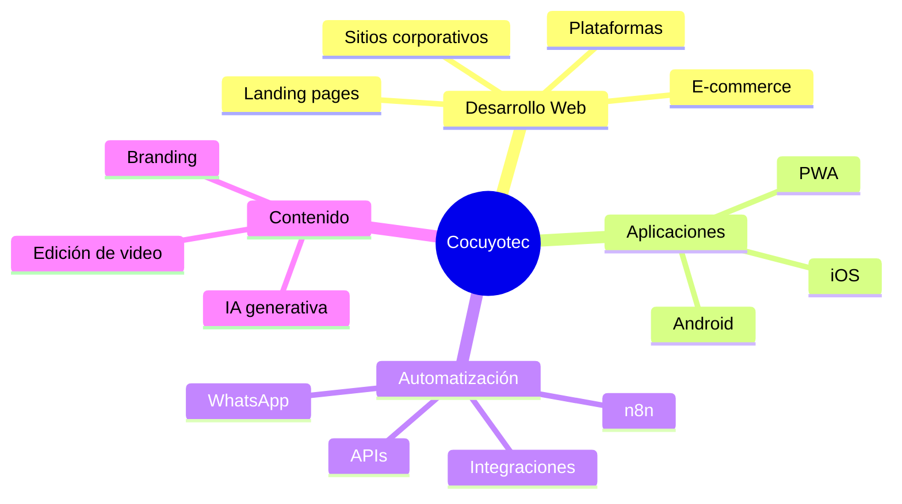
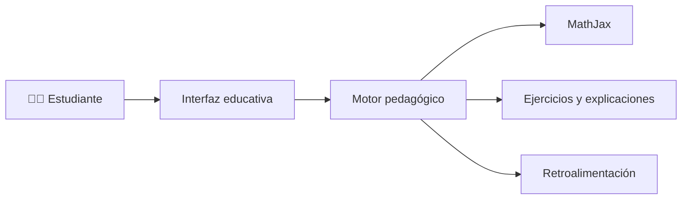
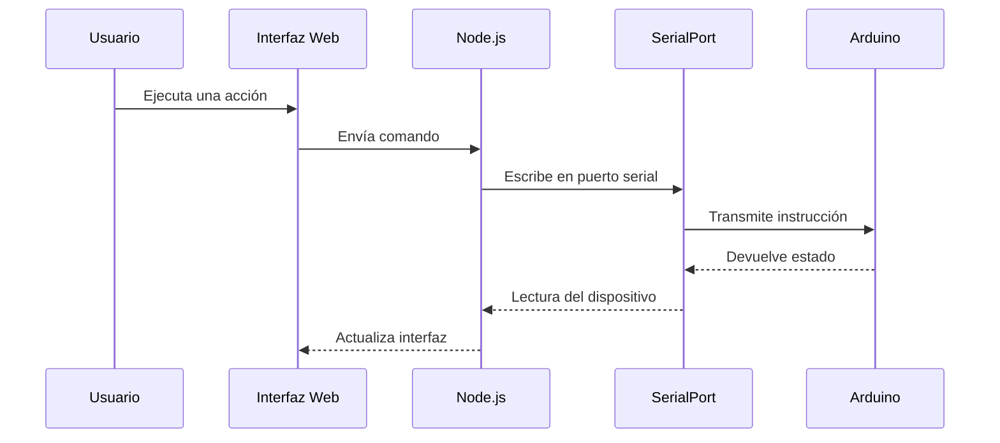
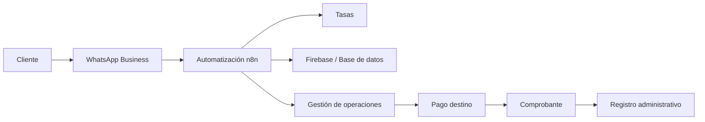
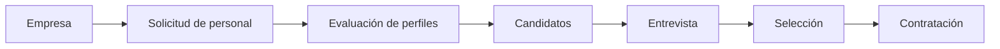
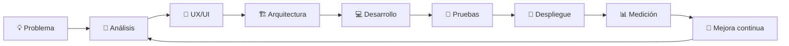

# 👋 ¡Hola! Soy Simón Vitriago

### Ingeniero Electricista · Desarrollador Full Stack · Automatización · IoT · IA aplicada

Construyo soluciones que conectan **software, automatización, electrónica, datos e inteligencia artificial** para resolver problemas reales.

---

## 🚀 Sobre mí

Soy **ingeniero electricista y desarrollador de software**, enfocado en crear productos digitales completos: desde la idea y la arquitectura hasta el despliegue, la automatización y la integración con sistemas físicos.

- 🌐 Desarrollo aplicaciones web modernas y responsivas.
- ⚙️ Automatizo procesos con **n8n, APIs, webhooks y bases de datos**.
- 🏭 Integro software con **PLC, SCADA, Arduino, sensores e IoT**.
- 🤖 Aplico inteligencia artificial a educación, contenido y productividad.
- 📊 Diseño dashboards, sistemas administrativos y herramientas de análisis.
- 🚀 Despliego proyectos en **Vercel, VPS, Docker, PM2 y servicios cloud**.
- 🎓 Comparto conocimientos sobre programación, electrónica e IA.

---

## 🧭 Ecosistema de proyectos

```mermaid
flowchart TB
    SV["👨‍💻 Simón Vitriago<br/>Ingeniería + Software + Automatización"]

    SV --> IND["🏭 Industria e IoT"]
    SV --> WEB["🌐 Productos Web"]
    SV --> AUTO["⚙️ Automatización"]
    SV --> EDU["🎓 Educación"]
    SV --> NEG["💼 Negocios Digitales"]
    SV --> IA["🤖 IA y Contenido"]

    IND --> SCADA["Sorter SCADA<br/>PLC Siemens + Node.js + PostgreSQL"]
    IND --> ARDUINO["Control Arduino Web<br/>SerialPort + Interfaces Web"]
    IND --> SOCKET["Socket Server<br/>Comunicación en tiempo real"]

    WEB --> COCUYO["Cocuyotec SPA<br/>Agencia tecnológica"]
    WEB --> PORTFOLIO["Portafolios profesionales"]
    WEB --> ECOMMERCE["Tiendas y catálogos"]
    WEB --> CLIENTES["Webs para clientes y marcas"]

    AUTO --> N8N["Flujos n8n"]
    AUTO --> WHATSAPP["WhatsApp Business"]
    AUTO --> APIS["APIs + Webhooks"]
    AUTO --> DATA["Firebase / PostgreSQL / Supabase"]

    EDU --> SOPHIA["Soph-IA<br/>Tutora virtual"]
    EDU --> ALURA["Challenges Alura ONE"]
    EDU --> JUEGOS["Juegos educativos"]
    EDU --> CALC["Calculadoras y utilidades"]

    NEG --> REMESAS["Sistema de remesas"]
    NEG --> ORBI["ORBI Ecosystem"]
    NEG --> CAPITAL["WOS Capital Humano"]
    NEG --> LIBROS["Plataformas editoriales"]

    IA --> VIDEOS["Contenido audiovisual con IA"]
    IA --> MUSICA["Música generativa"]
    IA --> NEWS["Contenido y noticias"]
```

---

## ⭐ Proyectos destacados

### 🏭 Sorter SCADA — Supervisión industrial en tiempo real

Sistema SCADA web diseñado para monitorear y analizar una línea de clasificación logística.

**Características principales**

- Lectura de señales del PLC y simulación en modo mock.
- Monitoreo de rampas, ocupación, fallas y pausas.
- Producción por hora y acumulados por turno.
- Cálculo de KPIs desde el backend.
- Persistencia histórica en PostgreSQL.
- Dashboard operativo y panel gerencial.
- Arquitectura preparada para Siemens S7, PLCSIM y entorno industrial.

**Tecnologías:** Node.js · Express · WebSocket · PostgreSQL · Siemens S7 · TIA Portal · PLCSIM · Factory I/O

---

### ✨ Cocuyotec SPA — Agencia tecnológica

Ecosistema digital para ofrecer soluciones de desarrollo y automatización.

🌐 **Sitio:** [cocuyotec.com](https://cocuyotec.com)  
📁 **Repositorio:** [cypictronic05/cocuyotec](https://github.com/cypictronic05/cocuyotec)

---

### 🤖 Soph-IA — Tutora virtual educativa

Proyecto educativo que combina una interfaz web con herramientas interactivas para apoyar el aprendizaje.

**Enfoque:** matemáticas, aprendizaje guiado, ejercicios interactivos y apoyo mediante IA.

Repositorios relacionados:

- [tutora-virtual-sophia-privacy-policy](https://github.com/cypictronic05/tutora-virtual-sophia-privacy-policy)
- [web-ingles-sophia-unit7](https://github.com/cypictronic05/web-ingles-sophia-unit7)
- [horario-sophia](https://github.com/cypictronic05/horario-sophia)

---

### 🔌 Control Arduino desde la web

Aplicación para comunicar una interfaz web con Arduino y dispositivos electrónicos.

📁 [control-arduino-web](https://github.com/cypictronic05/control-arduino-web)  
📁 [node-arduino-serialport](https://github.com/cypictronic05/node-arduino-serialport)  
📁 [socket-server](https://github.com/cypictronic05/socket-server)

---

### 💸 Plataforma de operaciones y remesas

Sistema orientado a administrar solicitudes, tasas, cálculos, comprobantes y operaciones internacionales.

**Componentes trabajados:** automatización de atención, cálculo de operaciones, gestión por país, validación de comprobantes y registro administrativo.

---

### 🌐 ORBI Ecosystem

Plataforma web que presenta un ecosistema de soluciones tecnológicas y servicios digitales.

🔗 [orbiecosystem.vercel.app](https://orbiecosystem.vercel.app/)

---

### 👥 WOS Capital Humano

Plataforma corporativa para reclutamiento y selección de personal, orientada especialmente a minería y otros sectores productivos.

🔗 [woscapitalhumano.cl](https://woscapitalhumano.cl)

---

### 📚 Salvador Escritor

Plataforma web de presentación y comercialización de obras editoriales.

📁 [salvador-escritor](https://github.com/cypictronic05/salvador-escritor)

---

## 🧩 Más proyectos públicos

| Proyecto | Descripción |
|---|---|
| [challenge-portafolio-2025](https://github.com/cypictronic05/challenge-portafolio-2025) | Portafolio profesional moderno |
| [personal-portfolio-2024](https://github.com/cypictronic05/personal-portfolio-2024) | Portafolio personal de desarrollador |
| [challenge-aluraGeek](https://github.com/cypictronic05/challenge-aluraGeek) | Catálogo tipo e-commerce |
| [challenge-encriptador-alura](https://github.com/cypictronic05/challenge-encriptador-alura) | Encriptador y desencriptador de texto |
| [Alura-One-Backend1](https://github.com/cypictronic05/Alura-One-Backend1) | Prácticas y retos backend |
| [alura-temporizador](https://github.com/cypictronic05/alura-temporizador) | Temporizador interactivo |
| [alura-midi](https://github.com/cypictronic05/alura-midi) | Instrumento musical web |
| [juego-secreto](https://github.com/cypictronic05/juego-secreto) | Juego de lógica y números |
| [tren-movimiento](https://github.com/cypictronic05/tren-movimiento) | Animación y movimiento web |
| [anatomy](https://github.com/cypictronic05/anatomy) | Proyecto visual y educativo |
| [capitales-paises](https://github.com/cypictronic05/capitales-paises) | Aplicación educativa de geografía |
| [digito-verificador](https://github.com/cypictronic05/digito-verificador) | Utilidad para validación de datos |
| [presupuesto](https://github.com/cypictronic05/presupuesto) | Herramienta de cálculo de presupuestos |
| [Artesania-Sergio-Rojas](https://github.com/cypictronic05/Artesania-Sergio-Rojas) | Web comercial para artesanía |
| [sergiorojascreaciones](https://github.com/cypictronic05/sergiorojascreaciones) | Sitio de marca y catálogo |
| [mercado-pago-documentacion](https://github.com/cypictronic05/mercado-pago-documentacion) | Integración y documentación de pagos |

---

## 🛠️ Tecnologías

### Frontend

  

### Backend y datos

  

### DevOps y despliegue

  

### Electrónica, automatización e industria

  

- Siemens PLC / TIA Portal
- PLCSIM y Factory I/O
- Comunicación serial
- WebSocket y sistemas en tiempo real
- SCADA web
- n8n, APIs REST y webhooks
- WhatsApp Business y automatización de procesos

---

## 🏗️ Cómo construyo soluciones

Mi objetivo no es solamente escribir código, sino entregar soluciones **útiles, medibles, mantenibles y preparadas para crecer**.

---

## 📊 Estadísticas de GitHub

---

## 🎯 Actualmente estoy trabajando en

- Sistemas SCADA web e integración con PLC.
- Aplicaciones empresariales con Node.js y PostgreSQL.
- Automatización de atención y operaciones mediante n8n.
- Productos digitales para Cocuyotec SPA.
- Herramientas educativas asistidas por IA.
- Integraciones entre software, electrónica y procesos reales.

---

## 🤝 Colaboraciones

Me interesan proyectos relacionados con:

- Automatización industrial.
- Plataformas web empresariales.
- Inteligencia artificial aplicada.
- Educación tecnológica.
- IoT y electrónica.
- Sistemas administrativos.
- Transformación digital para pequeñas y medianas empresas.

---

## 📬 Conectemos

**¿Tienes una idea, un proceso que automatizar o un proyecto tecnológico?**

### ⚡ Ingeniería que conecta ideas, software y tecnología.

